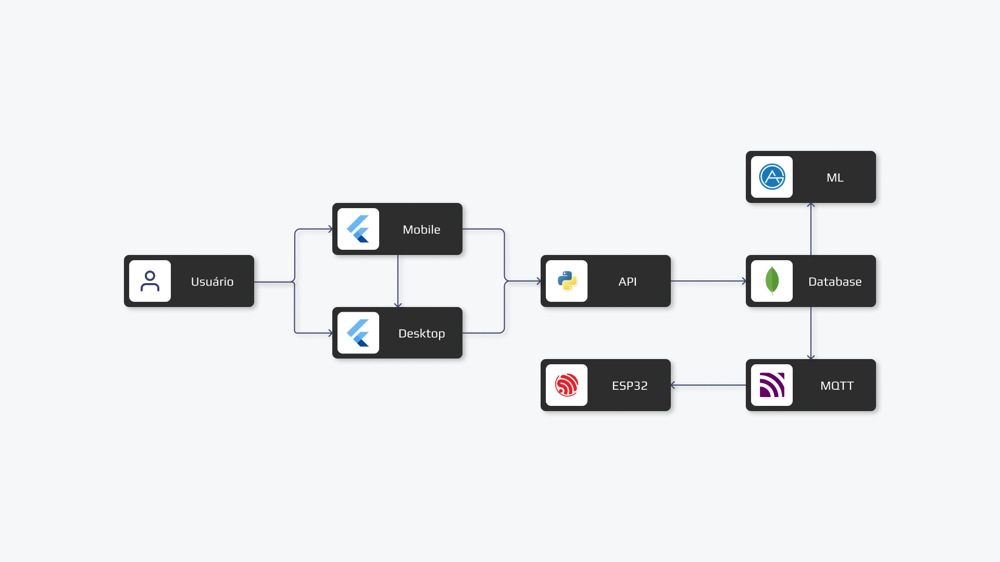

  

### 🟡 O que fazemos?
O objetivo deste projeto é desenvolver um sistema de localização indoor de baixo custo via Wi-Fi. Ao aproveitar a infraestrutura Wi-Fi existente e criar uma solução acessível que possa ser facilmente implementada em hospitais para melhorar localização de equipamentos médicos.

### 🟡 O que é localização indoor?
A tecnologia de localização indoor é uma inovação revolucionária que permite a localização precisa de pessoas ou objetos em ambientes fechados. Ao contrário do GPS, que tem dificuldades em fornecer localizações precisas em ambientes internos, a localização indoor utiliza sinais de Wi-Fi, Bluetooth e outras tecnologias para fornecer informações de localização precisas.

### 🟡 Quais são so benefícios do projeto?
Esse projeto de tecnologia de localização indoor oferece uma série de benefícios significativos. 
 - Baixo custo de implementação.
 - Facilidade de implementação.
 - Precisão e versatilidade.
 - Potencial para serviços personalizados.
 - Demanda crescente por soluções IoT.

Ao utilizar sinais de Wi-Fi para precisão na localização em ambientes fechados, supera as limitações do GPS nesses cenários. E ao aproveitar a infraestrutura Wi-Fi já existente, o projeto se torna de baixo custo e altamente viável para implementação em diferentes ambientes.

### 🟡 Tecnologias foram usadas para o desenvolvimento
Essas tecnologias foram selecionadas para o projeto com o objetivo de garantir alto desempenho,  eficiência e alta qualidade no projeto.

### 🟡 Arquitetura do projeto

  

### 🟡 Padrões de Commits

Esta organização segue uma convenção de commits para manter um histórico claro e consistente. Abaixo está uma tabela com os tipos de commits e suas descrições.

| Tipo de Commit | Descrição |
| -------------- | --------- |
| `feat`         | Adição de uma nova funcionalidade |
| `fix`          | Correção de um bug |
| `docs`         | Mudanças na documentação |
| `style`        | Alterações que não afetam o significado do código (espaços em branco, formatação, ponto e vírgula ausente, etc.) |
| `refactor`     | Refatoração de código, que não altera a funcionalidade nem corrige bugs |
| `perf`         | Alterações de código que melhoram o desempenho |
| `test`         | Adição ou correção de testes |
| `build`        | Mudanças que afetam o sistema de build ou dependências externas (ferramentas de compilação, bibliotecas, etc.) |
| `ci`           | Mudanças em arquivos e scripts de configuração de CI (Integração Contínua) |
| `chore`        | Outras mudanças que não modificam o código fonte ou os testes |
| `revert`       | Reversão de um commit anterior |
| `merge`        | Mesclagem de branches |
| `hotfix`       | Correção urgente de um bug crítico |

Siga esses padrões ao fazer commits para garantir um histórico de commits limpo e fácil de entender.
